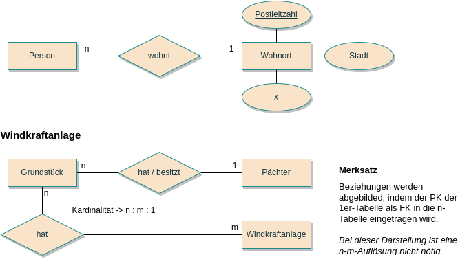
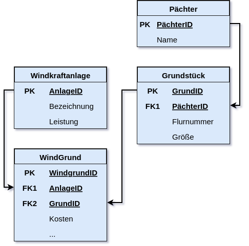
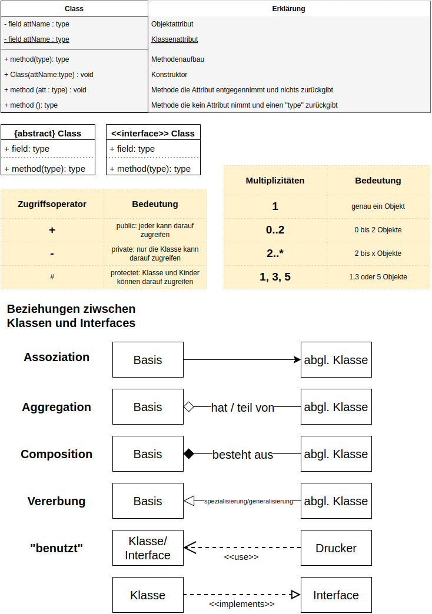
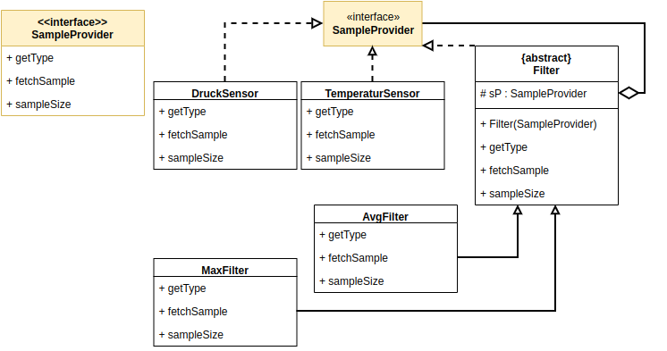
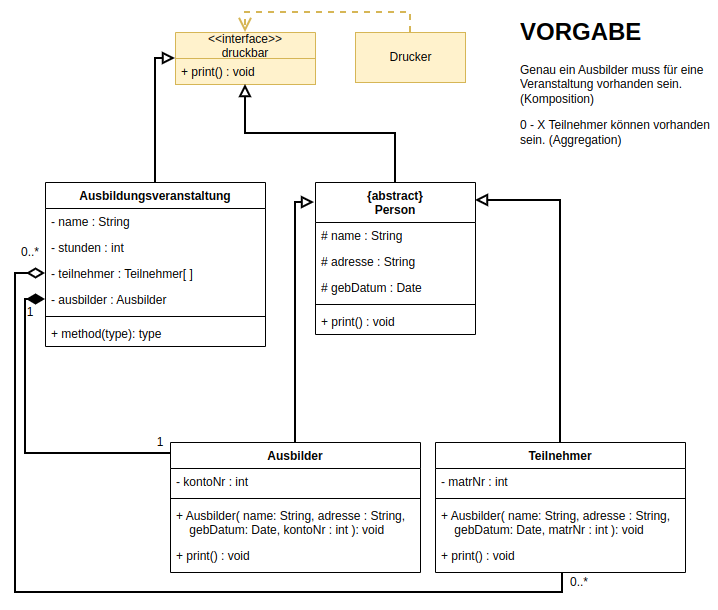
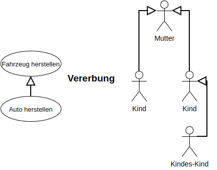
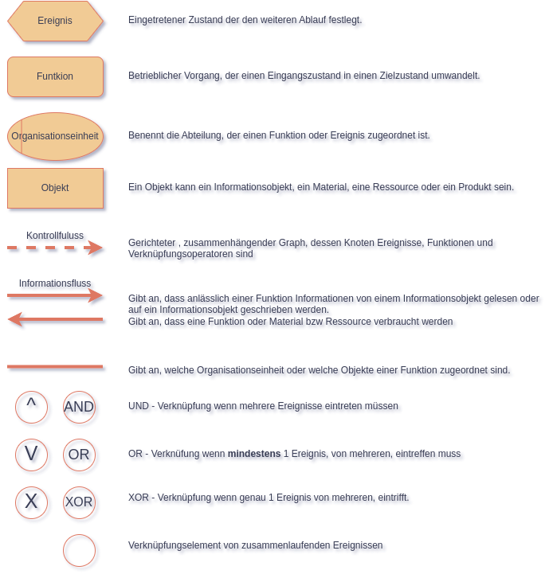
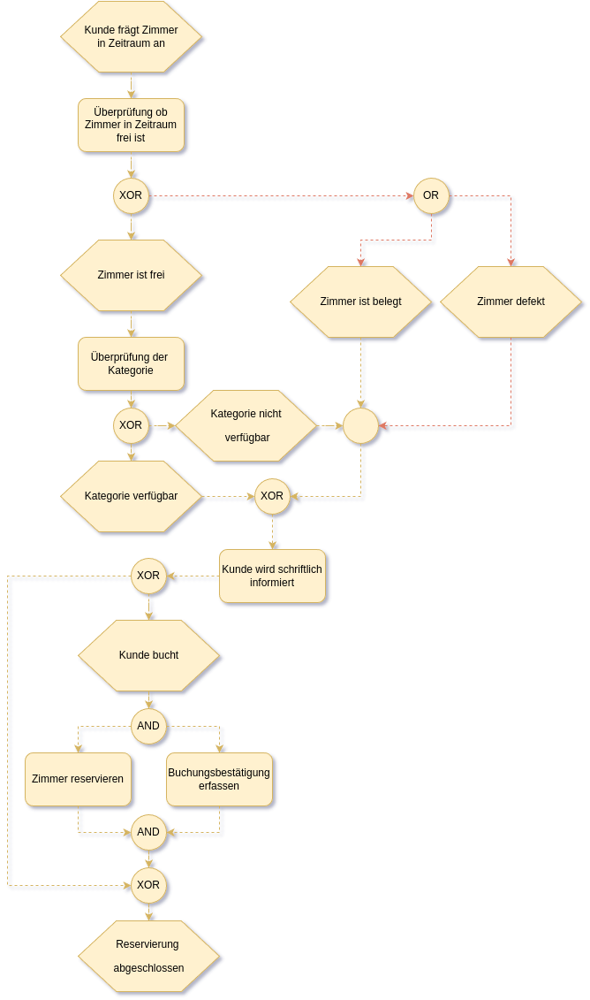
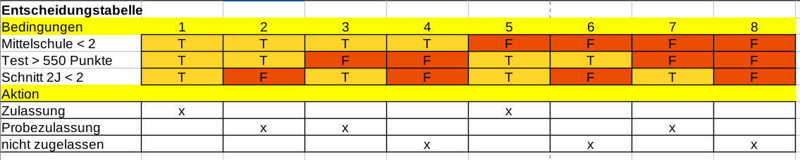

# [BACK](../index.html)
# Inhaltsangabe
- [Datenbanken ERM](#datenbanken-erm)
- [SQL-Datenbankdarstellung](#sql-datenbankdarstellung)
	- [ER-Chen](#er-chen)
	- [Physisches Modell](#physisches-modell)
- [Anwendungsentwicklung](#anwendungsentwicklung)
	- [Struktogramm](#struktogramm)
	- [PAP](#pap)
- [UML](#uml)
	- [Klassendiagramm](#klassendiagramm)
	- [Anwendungsfalldiagramm](#anwendungsfalldiagramm)
- [EPK](#epk)
- [Entscheidungstabelle](#entscheidungstabelle)

# Datenbanken ERM
*Entity-Relationship-Modell*

Das ERM ist ein Modell(zur Darstellung) von Dingen, Gegenständen, Objekten (= 'entities') und der Beziehung/Zusammenhängen zwischen diesen (= 'relationship'). Es dient dazu, im Rahmen der semantischen (abstrakt, formale Beschreibung / Darstellung eines Ausschnittes) Datenmodellierung vereinfacht darzustellen.

[TOP](#)

[TOP](#)

# SQL-Datenbankdarstellung
Darstellung in vielen SQL-Datenbankensystemen um die Beziehungen zwischen den bestehenden Tables darzustellen
Darstellung wie Datenbank tatsächlich modelliert wird mit PK,FK, ggf auch Datentypen

## ER-Chen
Vereinfachte Dartsellung von Entitäten und Attributen mit Kardinalitäten

ER Modell nach Chen Elemente

ER Chen Beisspiel 1

ER Chen Beisspiel 2

## Physisches Modell

[TOP](#)

[TOP](#)

# Anwendungsentwicklung
## Struktogramm
*Nassi-Schneidermann-Diagramm*

Struktogramm Elemente

Struktogramm Beisspiel

## PAP
*Programmablaufplan*

Ein Programmablaufplan ist ein Ablaufdiagramm für Computerprogramme, dass auch als Flussdiagramm oder Programmsturkturplan bezeichnet wird. Grafische Umsetzung eines Algorithmus

PAP-Elemente

PAP-Beisspiel

[TOP](#)

[TOP](#)

# UML
*unified modeling language*

## Klassendiagramm
UML Klassendiagramm-elemente

UML Klassendiagramm-beisspiel-1

UML Klassendiagramm-beisspiel-1

## Anwendungsfalldiagramm
UML Anwendungsdiagramm-elemente-1

UML Anwendungsdiagramm-elemente-2

UML Anwendungsdiagramm-elemente-3

UML Anwendungsdiagramm-beisspiel

[TOP](#)

[TOP](#)

# EPK
*ereignisgesteuerte  Prozesskette*

Die EPK ist eine grafische Modellierungssprache zur Darstellung von Geschäftsprozessen einer Organisation / Geschäftsmodellierung / Darststellung der Prozessorganisation (Abläufe + Arbeitsschritte)

EPK-Elemente

EPK_Beisspiel

[TOP](#)

[TOP](#)

# Entscheidungstabelle
Alle Möglichkeiten werden mittels Bedingung -> Aktion erfasst. Bei 3 Aktionen gibt es 2^3 Möglichkeiten

Entscheidungstabelle

