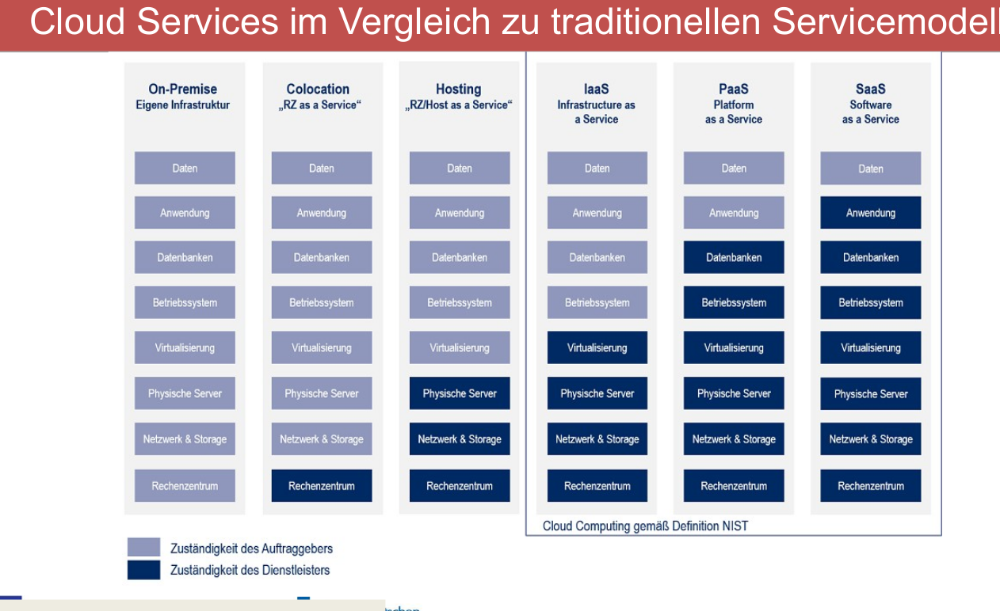
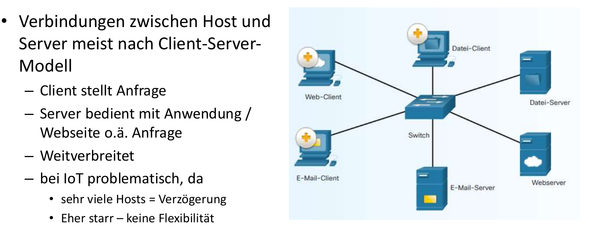

# [BACK](../index.html)
# Inhaltsangabe
- [BACK](#back)
- [Inhaltsangabe](#inhaltsangabe)
- [Cloud vs On-Premise](#cloud-vs-on-premise)
- [Cloudempfehlung](#cloudempfehlung)
- [Cloud-Modelle](#cloud-modelle)
	- [IaaS:Infrasturkture as a Service](#iaasinfrasturkture-as-a-service)
	- [PaaS:Platform as a Service](#paasplatform-as-a-service)
	- [SaaS:Software as a Service](#saassoftware-as-a-service)
- [Cloud Konzepte](#cloud-konzepte)
- [Charakteristik von Clouds](#charakteristik-von-clouds)
- [Vergleich der Services](#vergleich-der-services)
- [Servicetypen](#servicetypen)
- [Cloudbesitzer](#cloudbesitzer)
- [Verbindungsmodelle](#verbindungsmodelle)
	- [Client-Server-Modell](#client-server-modell)
	- [Cloud-Computing](#cloud-computing)
	- [Fog-Computing](#fog-computing)
	- [Sensor-Aktoren-Controller](#sensor-aktoren-controller)

# Cloud vs On-Premise
| |		Cloud-Sicherung	| 	On-Premise
|--------|-----------------------|--------------------------------------------
|Vorteil	| günstiger		| Datenschutz gewährleistet
|	| Daten dezentralisiert	| Expertiese bleibt im Unternehmen erhalten
|	| weniger arbeitsaufwand| kein Inet nötig
|	| Skalierbarkeit	| 
---	|----			|------
|Nachteil| Datenschutz schwierig	| teuer
|	| Expertise ausgelagert	| Daten unsicher -> zentralisiert
|	| Inet nötig		| mehr arbeitsaufwand
|	|			| nicht flexibel skalierbar

# Cloudempfehlung
Eine stabile und schnell Internetverbindung, Client Software um entsprechend eBackup-Strategien zu realisieren. Eine Userauthenzifizierung zum Schutz vor unbefugten Dritten, eine Verschlüsselung bereits schon auf dem zu sichernden System. Backupprozesse definieren

- Skalierbarkeit 
- Onlineerreichbar über Zugang
- kein Wartungsaufwand 
- schnelle Einrichtung
- in der Regel günstiger
- service-on-demand: höhere Verfügbarkeit
- flexible Strukturen

# Cloud-Modelle
## IaaS:Infrasturkture as a Service
Netzwerk, Speicher, VoIP-Telefonie, Backupsysteme oder Server wird gestellt, alles weitere muss eigenständig eingerichtet werden

## PaaS:Platform as a Service
Die Plattform wird gestellt,Email-Systeme, Web-Hosting, Betriebssystem, Entwicklungsumgebung, Datenbank. Die Systeme an sich muss konfiguriert werden, Software aufgespielt

## SaaS:Software as a Service
Software on Demand, Onlinespiele, Office-Anwendung, 365. Software wird gestellt und kann meist auch remote und online genutzt werden

# Cloud Konzepte
- Zentralisierung: Daten an einem Ort, von überall erreichbar
- Virtualisierung: virtuelle Maschinen, mehrere Anwendungen auf einem Server
- Automatisierung: Erstellung Maschienen, Anwendungen geschiet automatisiert, nicht manuell
- Standardisierung: Standards sind definiert, damit Automatisierung passen kann

# Charakteristik von Clouds

# Vergleich der Services

# Servicetypen

# Cloudbesitzer

# Verbindungsmodelle
## Client-Server-Modell

## Cloud-Computing

## Fog-Computing
 

## Sensor-Aktoren-Controller

