# [BACK](../index.html)
# Inhaltsangabe
- [DML](#dml)
- [Joins](#joins)

# DDL
*Data Definition Language*

DDL umfasst die Befehle zum Anlegen, Ändern und Löschen von Datenbanken, Tabellen und ihre Strukturen

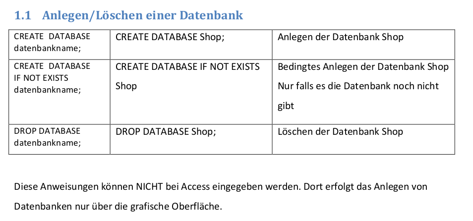

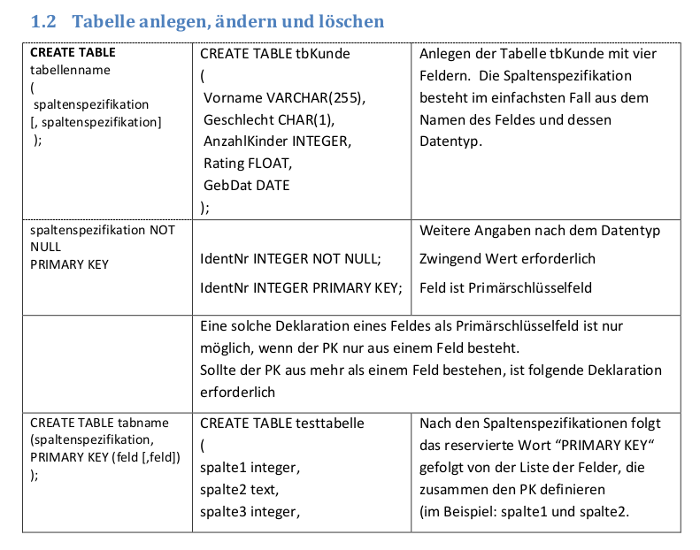

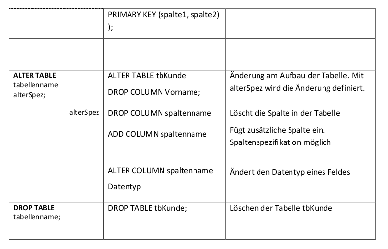

[TOP](#)
# DML
*Data Manipulation Language*

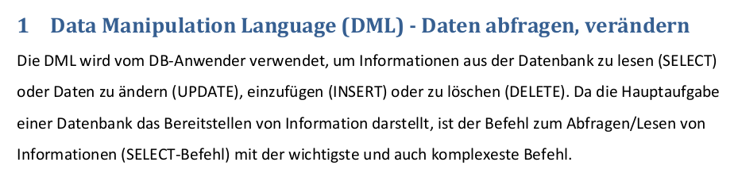

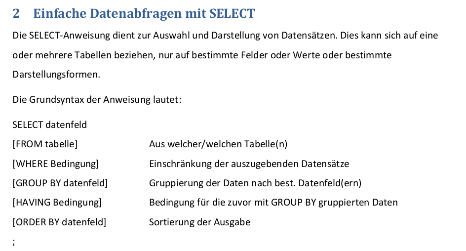

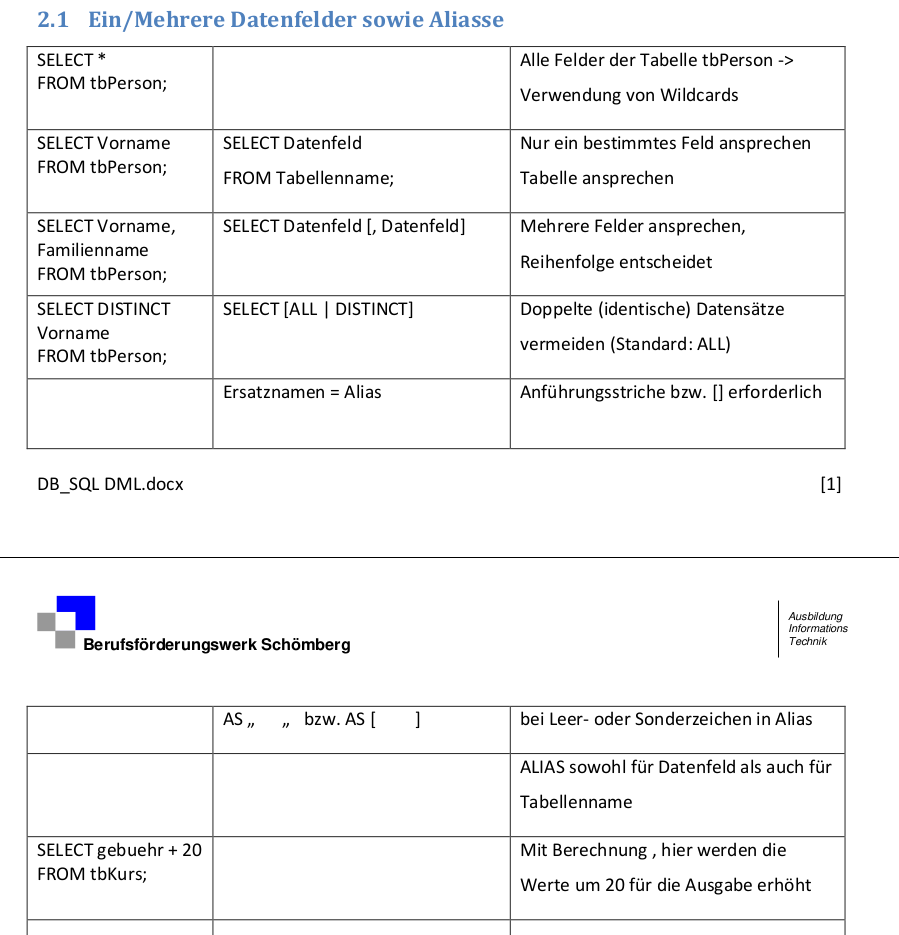

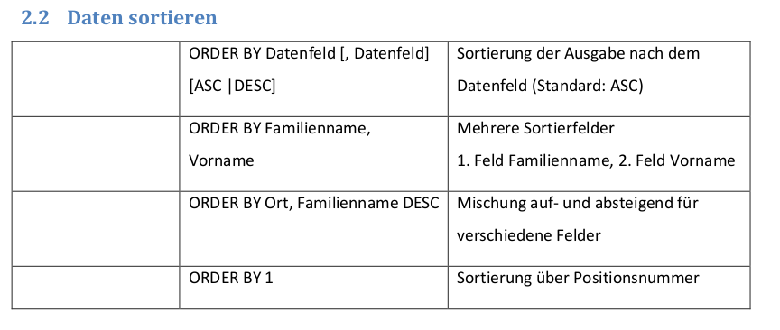

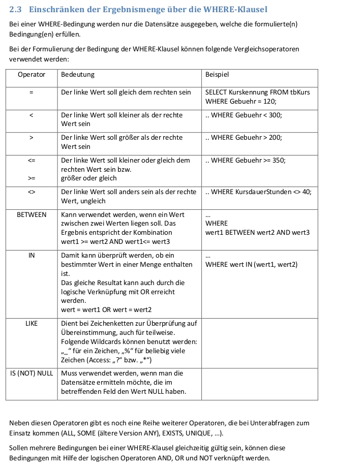

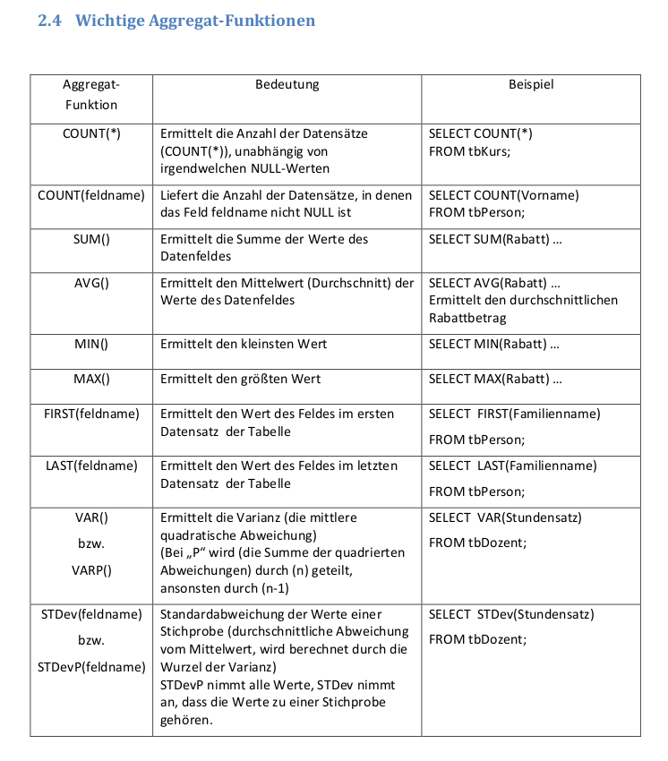

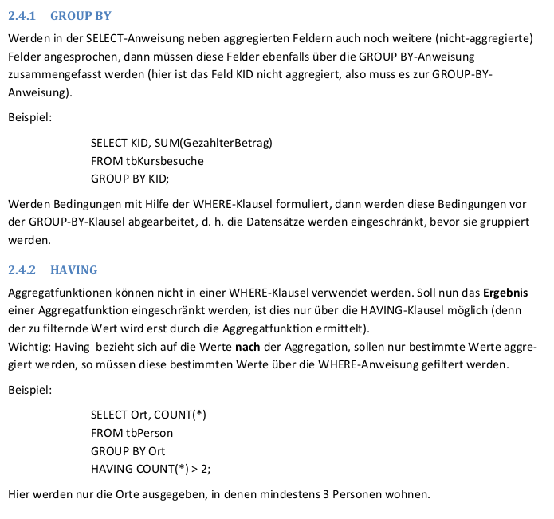

[TOP](#)
# Joins
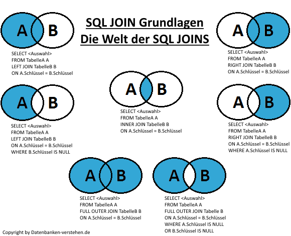
